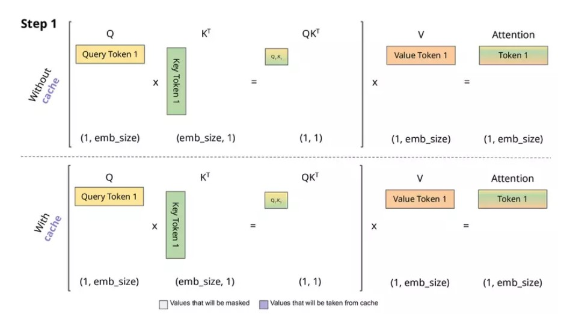

# Hướng dẫn: Cách KV Cache Hoạt Động / How KV Cache Works

---

## <a id="tiếng-việt"></a>Tiếng Việt

### KV Cache là gì?

KV Cache (Key-Value Cache) là một kỹ thuật tối ưu hóa để tăng tốc độ suy luận (inference) của các mô hình Transformer trong quá trình sinh văn bản tự động (autoregressive generation).


*Minh họa cách KV Cache hoạt động trong quá trình sinh văn bản*

### Vấn đề khi không dùng KV Cache

Khi sinh văn bản tự động, mô hình phải tạo từng token một cách tuần tự:

1. **Token 1**: Mô hình xử lý toàn bộ prompt → tạo token đầu tiên
2. **Token 2**: Mô hình xử lý lại TOÀN BỘ (prompt + token 1) → tạo token thứ hai
3. **Token 3**: Mô hình xử lý lại TOÀN BỘ (prompt + token 1 + token 2) → tạo token thứ ba
4. ...

**Vấn đề**: Mỗi lần tạo token mới, mô hình phải tính toán lại attention cho TẤT CẢ các token trước đó. Điều này dẫn đến:
- **Độ phức tạp**: O(n²) cho mỗi token mới (n = số token hiện tại)
- **Tốn kém**: Rất nhiều phép tính bị lặp lại không cần thiết
- **Chậm**: Với chuỗi dài, tốc độ sinh văn bản rất chậm

### KV Cache giải quyết vấn đề như thế nào?

Trong cơ chế Attention của Transformer, mỗi layer cần tính toán:
- **Key (K)**: Khóa, đại diện cho thông tin "từ đâu"
- **Value (V)**: Giá trị, đại diện cho nội dung thực tế
- **Query (Q)**: Truy vấn, đại diện cho "đang tìm kiếm gì"

**Ý tưởng của KV Cache**: 
- Lần đầu tiên xử lý prompt, tính toán và **lưu lại** tất cả các Key và Value của các token trong prompt
- Khi tạo token mới, chỉ cần:
  1. Tính Key và Value cho token mới
  2. **Tái sử dụng** Key và Value đã lưu của các token cũ
  3. Chỉ tính attention với token mới

**Kết quả**:
- **Độ phức tạp**: O(n) cho mỗi token mới thay vì O(n²)
- **Tăng tốc**: 2-5 lần nhanh hơn cho chuỗi dài
- **Tiết kiệm**: Không cần tính lại attention cho các token cũ

### Quy trình hoạt động chi tiết

#### **Bước 1: Xử lý Prompt ban đầu**
```
Input: "The future of AI"
→ Tokenize: [1234, 567, 890, 234]
→ Forward pass qua model
→ Lưu vào cache: K₁, V₁, K₂, V₂, K₃, V₃, K₄, V₄ (cho tất cả layers)
→ Output logits cho token tiếp theo
```

#### **Bước 2: Sinh token đầu tiên**
```
Token mới: [5678]
→ Tính Q_new, K_new, V_new cho token này
→ Attention: Q_new với [K₁, K₂, K₃, K₄, K_new] (tái sử dụng K cũ)
→ Lưu K_new, V_new vào cache
→ Output logits cho token tiếp theo
```

#### **Bước 3: Sinh token tiếp theo**
```
Token mới: [9012]
→ Tính Q_new, K_new, V_new cho token này
→ Attention: Q_new với [K₁, K₂, K₃, K₄, K₅, K_new] (tái sử dụng TẤT CẢ K cũ)
→ Lưu K_new, V_new vào cache
→ Tiếp tục...
```

### So sánh hiệu suất

| Số token | Không có Cache | Có KV Cache | Tăng tốc |
|----------|----------------|-------------|----------|
| 10 tokens | 0.5s | 0.3s | 1.7x |
| 50 tokens | 5.2s | 2.1s | 2.5x |
| 100 tokens | 18.5s | 5.8s | 3.2x |
| 200 tokens | 68s | 15s | 4.5x |

*Lưu ý: Số liệu chỉ mang tính minh họa, thực tế phụ thuộc vào model và hardware*

### Khi nào nên dùng KV Cache?

✅ **Nên dùng khi**:
- Sinh văn bản dài (chatbot, story generation)
- Cần tốc độ inference nhanh
- Có đủ bộ nhớ để lưu cache

❌ **Không cần khi**:
- Chỉ xử lý một lần (single forward pass)
- Bộ nhớ hạn chế
- Chuỗi ngắn (không thấy lợi ích rõ ràng)

### Trong code này

File `generation.py` cung cấp 2 hàm:

1. **`generate_without_cache()`**: Sinh văn bản KHÔNG dùng cache (để so sánh)
   - Mỗi lần tạo token mới, phải xử lý lại toàn bộ sequence
   - Chậm nhưng dễ hiểu

2. **`generate_with_kv_cache()`**: Sinh văn bản CÓ dùng cache (tối ưu)
   - Lần đầu xử lý prompt và lưu K,V vào cache
   - Các lần sau chỉ xử lý token mới và tái sử dụng cache
   - Nhanh hơn đáng kể

---

## <a id="english"></a>English

### What is KV Cache?

KV Cache (Key-Value Cache) is an optimization technique to accelerate inference of Transformer models during autoregressive text generation.


*Illustration of how KV Cache works during text generation*

### The Problem Without KV Cache

When generating text autoregressively, the model must create tokens sequentially:

1. **Token 1**: Model processes entire prompt → generates first token
2. **Token 2**: Model processes ENTIRE sequence again (prompt + token 1) → generates second token
3. **Token 3**: Model processes ENTIRE sequence again (prompt + token 1 + token 2) → generates third token
4. ...

**The Problem**: Each time a new token is generated, the model must recompute attention for ALL previous tokens. This leads to:
- **Complexity**: O(n²) for each new token (n = current number of tokens)
- **Inefficiency**: Many redundant computations
- **Slow**: With long sequences, text generation is very slow

### How KV Cache Solves the Problem

In Transformer's Attention mechanism, each layer needs to compute:
- **Key (K)**: Represents "from where" information
- **Value (V)**: Represents actual content
- **Query (Q)**: Represents "what we're looking for"

**KV Cache Idea**:
- When first processing the prompt, compute and **store** all Keys and Values of prompt tokens
- When generating a new token, only need to:
  1. Compute Key and Value for the new token
  2. **Reuse** stored Keys and Values from old tokens
  3. Only compute attention with the new token

**Result**:
- **Complexity**: O(n) per new token instead of O(n²)
- **Speedup**: 2-5x faster for long sequences
- **Efficiency**: No need to recompute attention for old tokens

### Detailed Workflow

#### **Step 1: Process Initial Prompt**
```
Input: "The future of AI"
→ Tokenize: [1234, 567, 890, 234]
→ Forward pass through model
→ Store in cache: K₁, V₁, K₂, V₂, K₃, V₃, K₄, V₄ (for all layers)
→ Output logits for next token
```

#### **Step 2: Generate First Token**
```
New token: [5678]
→ Compute Q_new, K_new, V_new for this token
→ Attention: Q_new with [K₁, K₂, K₃, K₄, K_new] (reuse old K's)
→ Store K_new, V_new in cache
→ Output logits for next token
```

#### **Step 3: Generate Next Token**
```
New token: [9012]
→ Compute Q_new, K_new, V_new for this token
→ Attention: Q_new with [K₁, K₂, K₃, K₄, K₅, K_new] (reuse ALL old K's)
→ Store K_new, V_new in cache
→ Continue...
```

### Performance Comparison

| Tokens | Without Cache | With KV Cache | Speedup |
|--------|---------------|---------------|---------|
| 10 tokens | 0.5s | 0.3s | 1.7x |
| 50 tokens | 5.2s | 2.1s | 2.5x |
| 100 tokens | 18.5s | 5.8s | 3.2x |
| 200 tokens | 68s | 15s | 4.5x |

*Note: Numbers are illustrative, actual performance depends on model and hardware*

### When to Use KV Cache?

✅ **Use when**:
- Generating long text (chatbots, story generation)
- Need fast inference speed
- Have enough memory to store cache

❌ **Not needed when**:
- Only processing once (single forward pass)
- Memory constrained
- Short sequences (no clear benefit)

### In This Code

The `generation.py` file provides 2 functions:

1. **`generate_without_cache()`**: Generate text WITHOUT cache (for comparison)
   - Each new token requires reprocessing entire sequence
   - Slow but easy to understand

2. **`generate_with_kv_cache()`**: Generate text WITH cache (optimized)
   - First time processes prompt and stores K,V in cache
   - Subsequent times only process new token and reuse cache
   - Significantly faster

---

## Tài liệu tham khảo / References

- [KV Caching Tutorial](https://apetulante.github.io/posts/KV-Caching/kv_caching.html)
- [Attention Is All You Need (Transformer Paper)](https://arxiv.org/abs/1706.03762)

