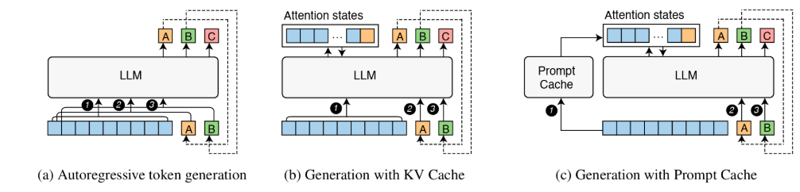

# Hướng dẫn: Cách Prompt Caching Hoạt Động / How Prompt Caching Works

---

## Tiếng Việt

### Prompt Caching là gì?

Prompt Caching là một kỹ thuật tối ưu hóa mở rộng từ KV Cache. Thay vì chỉ cache trong phạm vi một lần sinh văn bản, Prompt Caching **lưu trữ trạng thái KV của các đoạn prompt phổ biến** (như system prompt, context tài liệu) để tái sử dụng cho nhiều request khác nhau.

### Vấn đề

Trong nhiều ứng dụng LLM (như Chatbot RAG, Agent), một phần lớn của prompt là **tĩnh** và lặp đi lặp lại:
- **System Prompt**: "Bạn là trợ lý AI hữu ích..." (Lặp lại mỗi request)
- **Context**: "Dựa trên tài liệu sau đây..." (Lặp lại cho nhiều câu hỏi về cùng tài liệu)

Nếu không có Prompt Caching, mô hình phải tính toán lại KV cho phần tĩnh này **mỗi lần**, gây lãng phí tài nguyên và tăng độ trễ.

### Giải pháp

1.  **Lưu trữ (Store)**: Khi xử lý một prompt, hệ thống lưu lại KV Cache của nó vào bộ nhớ (RAM/VRAM).
2.  **Khớp tiền tố (Prefix Matching)**: Khi có request mới, hệ thống kiểm tra xem phần đầu (prefix) của prompt mới có trùng với cache nào đã lưu không.
3.  **Tái sử dụng (Reuse)**:
    - Nếu trùng, tải KV Cache của phần trùng đó lên.
    - Chỉ tính toán tiếp cho phần **mới** (suffix).

*Cấu trúc Radix Tree giúp tìm kiếm tiền tố hiệu quả*

### Ví dụ Minh họa

**Request 1:**
Prompt: `[System Prompt A] + [User Query 1]`
- Tính toán: Toàn bộ `[System Prompt A]` và `[User Query 1]`.
- Lưu Cache: `Cache_A` tương ứng với `[System Prompt A]`.

**Request 2:**
Prompt: `[System Prompt A] + [User Query 2]`
- Phát hiện: `[System Prompt A]` đã có trong `Cache_A`.
- Tải `Cache_A`.
- Tính toán: CHỈ `[User Query 2]`.
- **Kết quả**: Nhanh hơn rất nhiều (giảm Time To First Token).

*Minh họa cơ chế Prompt Caching*

### Xử lý Tokenization (Lưu ý quan trọng)

Tokenization có thể thay đổi ở biên giới giữa các từ.
Ví dụ: "apple" + "pie" -> "apple", "pie" (2 tokens)
Nhưng "apple" + "s" -> "apples" (1 token)

Khi ghép `[System Prompt]` + `[User Query]`, token cuối cùng của System Prompt có thể bị gộp với token đầu tiên của User Query.
**Giải pháp trong code**: Chúng tôi sử dụng kỹ thuật **Truncation**. Nếu phát hiện sự không khớp ở biên giới, chúng tôi cắt bỏ phần cache không khớp và tính toán lại một vài token ở biên giới để đảm bảo chính xác.

---

## English

### What is Prompt Caching?

Prompt Caching is an optimization technique extending KV Cache. Instead of caching only within a single generation session, Prompt Caching **stores the KV states of common prompt segments** (like system prompts, document contexts) to be reused across multiple different requests.

### The Problem

In many LLM applications (like RAG Chatbots, Agents), a large portion of the prompt is **static** and repetitive:
- **System Prompt**: "You are a helpful AI assistant..." (Repeated every request)
- **Context**: "Based on the following document..." (Repeated for multiple questions about the same doc)

Without Prompt Caching, the model recomputes the KV for this static part **every time**, wasting resources and increasing latency.

### The Solution

1.  **Store**: When processing a prompt, the system saves its KV Cache to memory (RAM/VRAM).
2.  **Prefix Matching**: When a new request arrives, the system checks if the beginning (prefix) of the new prompt matches any stored cache.
3.  **Reuse**:
    - If a match is found, load the KV Cache for that matching part.
    - Only compute for the **new** part (suffix).

*Radix Tree structure for efficient prefix matching*

### Illustration

**Request 1:**
Prompt: `[System Prompt A] + [User Query 1]`
- Compute: Entire `[System Prompt A]` and `[User Query 1]`.
- Store Cache: `Cache_A` corresponding to `[System Prompt A]`.

**Request 2:**
Prompt: `[System Prompt A] + [User Query 2]`
- Detect: `[System Prompt A]` exists in `Cache_A`.
- Load `Cache_A`.
- Compute: ONLY `[User Query 2]`.
- **Result**: Much faster (reduced Time To First Token).

*Prompt Caching Mechanism Illustration*

### Handling Tokenization (Important Note)

Tokenization can change at word boundaries.
E.g., "apple" + "pie" -> "apple", "pie" (2 tokens)
But "apple" + "s" -> "apples" (1 token)

When concatenating `[System Prompt]` + `[User Query]`, the last token of the System Prompt might merge with the first token of the User Query.
**Solution in code**: We use **Truncation**. If a mismatch is detected at the boundary, we truncate the cache to the matching length and recompute the few boundary tokens to ensure correctness.
